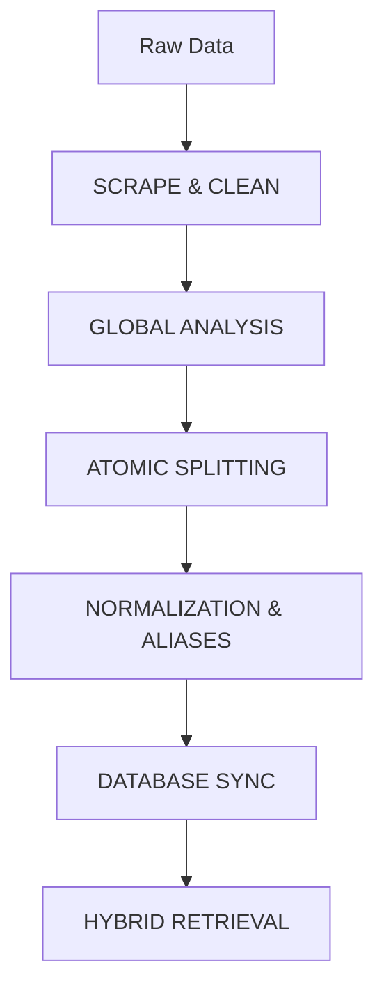

# MSAJCE Academic AI (Production-Grade Hybrid System)

A deterministic, context-aware RAG system designed for Mohamed Sathak A.J. College of Engineering. This system eliminates hallucinations by prioritizing structured database lookups over general AI reasoning.

## 🏗️ System Architecture (v2)

The system uses a **Triple-Path Hybrid Retrieval** architecture:

1.  **Deterministic Entity Path**: All names (Yogesh, Ram) and institutional roles (Principal, HOD) are resolved directly from MongoDB. Zero tokens used. 100% accuracy.
2.  **Structured Logistics Path**: Complex institutional data like college bus routes, stop timings, and MTC paths are calculated using a specialized logic layer (Module 3).
3.  **Advanced RAG Path**: General inquiries (About, Admission, Vision) are handled via a hybrid BM25 + Semantic search using Gemini 2.0 Flash.

## 🚀 Key Modules (The AI Product)

### Module 1: Data Freshness
Every record in the database is timestamped with a `last_updated` field. The system tracks data staleness to ensure information like bus timings remains current.

### Module 2: Entity Ranking
Deterministic matches are ranked by institutional importance (e.g., *Principal* takes precedence over *Student* matches for the same name/alias).

### Module 3: Computation Layer
Supports logical queries like:
*   *"Earliest bus from college"* (Logical DB sorting)
*   *"Is there a route through [Stop]?"*
*   *"Principal and Transport"* (Multi-query splitting)

### Module 4 & 5: Feedback & Self-Improvement
All ambiguous or failed queries (where no data exists) are logged to the `failed_queries` collection. This data is exposed to the dashboard for administrative enrichment.

## 🛠️ Ingestion Workflow

## ⚙️ Technical Stack
*   **LLM**: Google Gemini 2.0 Flash (via OpenRouter)
*   **Vector DB**: MongoDB Atlas Vector Store
*   **Database**: MongoDB (Entities, Transport, MTC, Logs)
*   **Embeddings**: OpenAI text-embedding-3-small
*   **Bot Framework**: Telegraf (Telegram)

## 🚦 How to Run
1.  **Ingest Data**: `node scripts/ingest.js` (Syncs all ground-truth records).
2.  **Bot Service**: `node bot.js` (Starts the Telegram interaction layer).
3.  **Audit API**: `node api/server.js` (Backend for the dashboard).
4.  **Audit Dashboard**: `npm run dev` in `/dashboard`.

---

© 2026 MSAJCE | Grounded Institutional Intelligence
